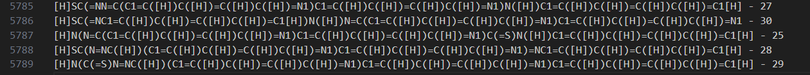
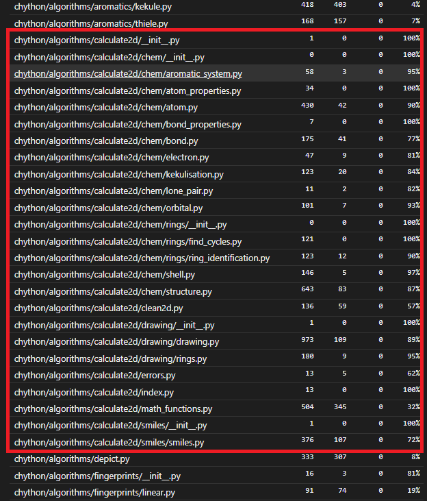

### chython

Пропустил через проду файл с 12711 строками smiles, 5789 завершили работу с ошибкой, категории ошибок в основном делятся на 3 типа:
- не реализован алгоритм обработки явного отображения водородных связей (самая распространенная ошибка)
- возникает ошибка кекулизации молекулы
- ошибка типа (встречается крайне редко)